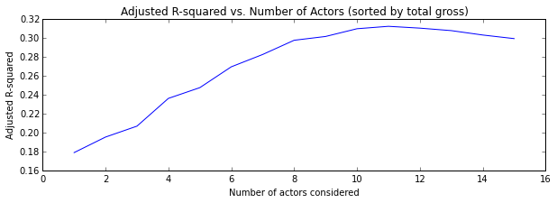
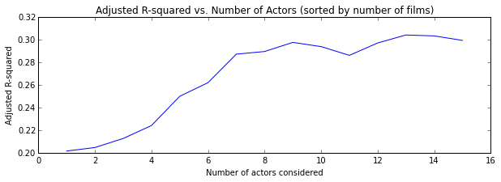
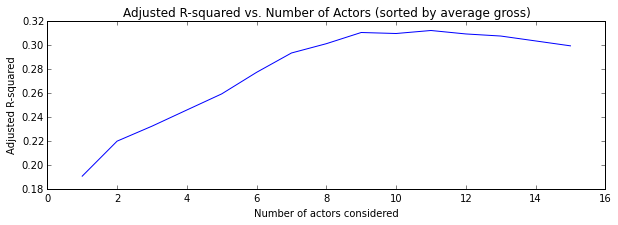
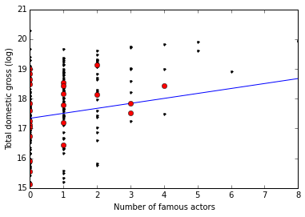
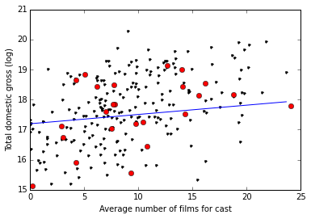
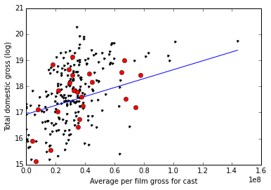

The movie business is one of the most lucrative and omnipresent forces in the American economy, grossing over ten billion dollars a year in ticket sales alone and providing the backdrop for a celebrity culture that permeates the average American's daily life. Since the early days of film, movie stars have been the fuel that the movie industry uses to continually churn out content; it was not uncommon for early actors to be in a dozen films per year. Nowadays, due to the longer production times associated with big-budget movies, even the most ambitious and active stars can barely fit in four or five films a year ... and that's only if they are in demand enough to get the offers.

<!--more--> 

In this post, I'd like to posit a set of (albeit incomplete) archetypes that describe the different levels of actor activity in Hollywood. These categories are hardly exhaustive, and apply mostly to actors who have already managed to lodge their names (or at least their faces) squarely in the minds of the entire populace. In further iterations of this research, it would be prudent to include newer actors and make finer distinctions between all actors. Nevertheless, on to the categories!

### The go-to actor

These actors have been around for a while, and if you see more than one huge blockbuster a year, you'll almost certainly see their faces. For example, take Samuel L. Jackson, pictured above. He has most recently been in a number of the Marvel blockbuster movies; before that, he featured prominently in the Star Wars reboots and a number of popular Quentin Tarantino films. These actors seem to be drawn to big-budget films like flies to the light, and they draw moviegoers to the theaters in exactly the same way. These are the actors whose movies have grossed the most money in total over the span of their careers. Other examples include Tom Hanks, Bruce Willis, and Cameron Diaz.

### The "oh-yeah-that-guy" actor

Quick test: how many of you recognize this guy?

Quick test part 2: how many of you could have come up with that guy's name within five seconds by his picture alone? 

My guess is that mostly everyone *recognizes* this actor (whose name is at the bottom of this paragraph to make the test a bit more fair), but far fewer can recall his name quickly. Actors like this enjoy facial recognition because of the simple fact that they've been *in* more films than other actors. These actors don't necessarily take lead roles all the time, and tend to split their time between bigger-name ventures and independent films. Other examples include [Lin Shaye](https://pauldergarabedian.files.wordpress.com/2015/06/lin-shaye.jpg), [Alfred Molina](http://news.doddleme.com/wp-content/uploads/2012/01/alfred-molina-0.jpg), and [Richard Jenkins](https://cbsnewyork.files.wordpress.com/2010/08/103334552_10.jpg) (oh, and of course Steve Buscemi, pictured above).

### The golden goose

Everything these actors touch is a hit, and they are arguably some of the most recognized figures in American culture. Many of these individuals are franchise stars: Emma Watson, pictured above, was in all seven ... oh sorry I mean eight ... Harry Potter films, and has been in little else since. Others are judicious in the movies they choose to be in, exercising their star power for maximum profit (think Will Smith). These are the actors whose movies have grossed the most amount of money *on average*. Other examples include Megan Fox, Bryce Dallas Howard, and Shia LaBeouf.

**Important Note**: There are certainly more archetypes than the three mentioned above, and there is even a good amount of overlap even between these three categories. For example, Samuel L. Jackson is at the top of both of the lists for total gross and total number of movies ... but let's assume for the moment that he's a bit of an outlier. 

## But who should be in my film?

From the perspective of someone making a blockbuster film, you would want your film to make the most amount of money possible. There are clearly hundreds if not thousands of choices that film executives, directors, cinematographers, and casting directors make to maximize box office performance; everyone wants to make the next hit film. The question I investigated for my second project at Metis addressed one important aspect of this decision space: can the number and type of actors you have in your film do a good job of predicting total gross box office sales?

##Process

In order to frame this as a linear regression problem, I first had to find data on films and actors. I scraped the BoxOfficeMojo and IMDB websites for the following information about movies and actors:

- What were the top fifty summer movies for each year from 2011-2015, and how much money did they gross?
- Which actors were in each of these films?
- How much money did each of these actors' films make *pre-2011*?

This recursive problem gave me a good amount of experience with scraping web pages (thanks [Beautiful Soup](http://www.crummy.com/software/BeautifulSoup/bs4/doc/)!), as well as more hands-on experience with manipulating data frames in [pandas](http://pandas.pydata.org/). One of the biggest challenges was figuring out how to organize all the data I had collected, and how to rectify inconsistent information between IMDB and BoxOfficeMojo (ironically, the former company owns the latter). But you don't want to hear about that data scrubbing nightmare, so I'll take your questions off air.

There is an important balance one needs to strike when collecting data. On the one hand, you want to minimize the amount of actual time you spend scraping the web, and you don't want to scrape the same information twice. The reason for this, apart from it being time consuming, is that many of the websites on the internet don't like being crawled through. It is not uncommon for a website to throw a [HTTP 403 error](http://www.solvusoft.com/blog/wp-content/uploads/2013/09/Protocol-HTTP-403-Forbidden-SolvuSoft1.png) when it gets too many requests in a short time span. On the other hand, you want to maximize the amount of actual information you obtain; no model ever benefitted from having too little data.

I addressed this issue by deciding to gather information about the first 15 actors listed on each IMDB movie page. This is the default view for each page, and in most situations it captured the information I wanted it to. The one situation it didn't handle perfectly was the "cast listed in order of appearance" situation. Many movies open with minor characters having a conversation, often played by unknown actors; likewise, some movies don't reveal their star until 20 or 30 minutes into the film. In further iterations of this project, I'd want to make sure I was scraping this information more thoroughly and consistently.

## Feature Engineering and Model Selection

Now that I had the data, I had to figure out what to do with it. In order to predict the gross of a movie, I wanted to use a couple different types of indicator. Firstly, *how many* "famous actors" are in the movie? I defined someone as famous if their average movie gross landed them in the top 100 (using data from BoxOfficeMojo). Secondly, what were the historical grosses (pre-2011) of the actors in that movie? Assuming that each actor had, on average, ten movies before 2011, that gave me 150 features to use as predictors. In order to keep the complexity of my model under control, I decided to use as features the averages of the statistics of the "top N actors," as well as the number of famous actors in the movie. Two new problems arose when trying to quantify the former of these:

- What does "top" mean? Should I be singling out the Samuel L. Jacksons, the Steve Buscemis, or the Emma Watsons?
- What is a good cutoff value for N?

In order to address these abstractions, I resorted to making *all* the models. That is, I made 45 different linear models, each with a different method of rating actors and each with a different scope of how many actors from each movie to consider. Given these 45 models, I measured how well each of the models explained the variance within the data set, using a statistic called the [coefficient of determination](https://en.wikipedia.org/wiki/Coefficient_of_determination) (or R-squared). Higher R-squared values correspond to better model fits. 

First, the scores of each model considering the top N total grossing actors (go-tos):

Next, the scores of each model considering the top N actors who'd been in the most films ("oh yeah that guy"s):

Finally, the scores of each model considering the top N average grossing actors (golden geese):

The model that explained most of the variance was constructed by averaging the statistics of the top 11 highest grossing actors, with an adjusted R-squared value of 0.313.

##Model Performance

The final step was to test this new model on a reserved test set of labeled data. This is an important part of doing any sort of modeling: always save a good portion of the data that's given to you for evaluation of your model! That is, *train* your model on a training set, but then *test* it on data it hasn't seen before. This is obviously old news for anyone who's worked with these frameworks before, but often trips up those new to the field. 

**Disclaimer:** Before I talk directly about results, I want to clarify one thing. The distribution of the gross sales for these movies was *not* a normal distribution, which makes linear regression a little tricky. Jurassic World made 650 million dollars, whereas The Guard made only 5 million; in general, there tend to be outliers on the upper end of this scale. In order to "normalize" these values, I instead attempted to predict the natural logarithm of these gross box office values; don't be confused by the seemingly tiny values on the y-axes below!

One standard way of measuring how good the model fits the test data is to find the mean squared error. In this case, the MSE comes out to 0.866, which admittedly doesn't mean much as a lone statistic, especially given the log transform mentioned in the paragraph above. In order to more fully see what was going on, I wanted to graph the final grosses against each of my predictors, with a trend line representing the one-dimensional projection of the model's prediction plane.

Here, for example, is a graph of total gross vs. number of famous actors. The black points represent the data I trained my model on, the blue line is the model's predictions, and the red points are the testing data. 

This first graph is strange, in that the independent variable is a discrete integer value (hence the vertical lines of points). As you can see, the model does a pretty bad job of predicting gross when no one famous is in the movie. This is a clear limitation of the way I structured my features: if we take the top 11 actors from a movie but no one knows who they are, it's difficult for the model to predict anything at all. On the other hand, the model seems to do a better job of prediction as more and more famous actors are added to the cast. 

Next let's look at the total gross vs. the average experience of the cast members:

This doesn't seem like a very good predictor at all if you ask me.

And finally, the total gross vs. the average historical gross for the film's actors:

Here, the data seems to be clustered around 40 million average historical gross. The problem with averaging together the "top 11 stars" of the film is that it seems to homogenize the population; it's exceptionally rare that you get 11 golden geese turning out for a single film.

## Conclusions and Next Steps
Since there are so many aspects to making a movie, it's not surprising that considering *only* the actors in the film doesn't make for excellent predicions. However there is still a lot to learn from this analysis. It looks like if you want to *guarantee* a high grossing summer blockbuster film, you should include at least 3 famous actors. Experienced actors are less important, but still positively affect gross numbers. There may also be ground to be gained by averaging together less than 11 actors from each film; it's likely that most moviegoers don't really care about any of the actors who aren't starring or in a big supporting role. 

Moving on from here, I'd like to take into account some of the other reasons people go to see blockbuster movies: for direction/cinematography, 3-D animation, and of course, explosions. Actors make up an important part of our cultural web, but sometimes people go to the movies just because it's hot out, or because they want to get lost in a story. Furthermore, I'd like to dig deeper into the notion of what makes an actor "famous"; average historical movie gross is one indication, but doesn't seem to faithfully represent the current stardom of actors like Emma Stone, Jennifer Lawrence, and Chris Pratt.

Hope you enjoyed this exploration, and be sure to come back for fun with music festivals next week!