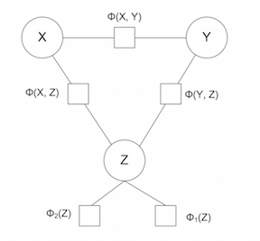

Hi everyone. We're here today to talk about something very serious. There's this social media network called [Twitter](http://twitter.com/) where people write short messages to the world. The sentiments of these messages are sometimes [helpful](https://twitter.com/Dr_Dakin/status/561107496266649600), sometimes [hurtful](https://twitter.com/YoMamaJabs/status/232930784942620672), sometimes [obvious](https://twitter.com/DeepLifeQuotes/status/649011600645488641), and sometimes [obviously misguided](https://twitter.com/realDonaldTrump/status/509814075787051008?ref_src=twsrc%5Etfw). 

<!--more--> 

One common tactic to gain followers (the only true metric of one's [worth](../images/My_Twitter.jpg) on Twitter) is to engage in a human tradition **even older** than Twitter itself: telling jokes. Now, I know what you're thinking. These messages have to be short -- 140 characters or less! -- and that seems like a *pretttttty* big restriction on the types of jokes one might tell. You, faithful reader, are right about that; however, Twitter still manages to abound with short-form jokes of different types. There are the more structured forms, like call-and-response jokes ("[Knock Knock, Who's There](https://twitter.com/MatthewLorXIII/status/650819676109312000)") and  double entendre recognition ("[That's What She Said](https://twitter.com/RebeccaHand1/status/650803550050762752)"), as well as a variety of more unstructured forms, like [puns](https://twitter.com/Darci0013/status/650046665215373312) and one-liners.

One especially popular structured joke format is as follows:

**I like my (X) like I like my (Y), (Z).**
	
As you can imagine, **(X)** and **(Y)** are typically nouns or noun phrases, and **(Z)** is typically an adjective or adjectival phrase. This joke format is the topic of some [recent research](http://homepages.inf.ed.ac.uk/s0894589/petrovic13unsupervised.pdf) out of Scotland by Saša Petrović and David Matthews. The two researchers developed an unsupervised machine learning algorithm that actually *generates* this type of joke.

Think about that for a second. Computers do all sorts of really cool things like beat us at chess and Jeopardy!, bring us instantaneous search results (no matter how [inane](http://i.telegraph.co.uk/multimedia/archive/01477/what-would-a_1477761a.jpg) the query), and help us prove [hard](http://arxiv.org/pdf/1201.0749v2.pdf) [mathematical](http://www.austms.org.au/Publ/ANZIAM/V48P2/pdf/2409.pdf) [theorems](http://annals.math.princeton.edu/wp-content/uploads/annals-v162-n3-p01.pdf). But when it comes to the task of making a human laugh, the closest we have is Siri giving us sassy pre-loaded responses to our questions.

Natural language processing is both a generally hard problem and a huge area of research. Generally speaking, human language has complex semantic layers that depend on context, the speaker's inflection, accompanying gestures, and a score of other variables difficult for a computer to parse. Even assuming that we could sufficiently solve the problem of making a computer's voice sound natural, making its *words* sound natural is a much deeper problem. Many researchers in this field understandably limit themselves to focusing on fully contained subproblems like the one considered by Petrović and Matthews.

### Model

The best way to understand how this joke generation model works is to consider the relationships between the words **(X)**, **(Y)**, and **(Z)**.

A quick breakdown: 

- The functions **Φ(X, Z)** and **Φ(Y, Z)** measure the respective probabilities that the adjective **(Z)** can be sensibly used to modify the nouns **(X)** and **(Y)**.

- The function **Φ(X, Y)** measures the probability that **(X)** and **(Y)** are *dissimilar* nouns. For example, the words "girls" and "boys" are in one sense opposites; in fact, we will measure these words to be quite similar in terms of the type of object they represent. 

- The functions **Φ(Z)** measure two probabilities, known as attribute surprisal and attribute ambiguity. These functions favor adjectives that are less commonly used and have multiple different definitions.

The authors use different combinations of these probability functions to build three versions of their model. In addition, this model was largely unsupervised: the only information it was given was a noun for **(X)** (scraped from Twitter!), and it searched the space of words for suitable words for **(Y)** and **(Z)** that would maximize these probability functions. 

### Data

The data on word usage used to build these models was mostly pulled from Google's [n-gram data](https://books.google.com/ngrams). This database of words and phrases was built from a large corpus of English language texts. The Google researchers grouped words into "n-grams" (i.e. phrases with "n" words) and ran a frequency analysis of how often each phrase was used throughout history. For the purposes of the joke generation study, Petrović and Matthews looked at the Google 2-grams, and then tagged these phrases with their grammatical parts of speech from Princeton's [WordNet](https://wordnet.princeton.edu/) database. 

### Results

The really fun part of this research is reading the jokes that Petrović and Matthews were able to generate via their algorithms. Their paper unfortunately only enumerates three of these jokes, but after a little digging I found the "human eval data" hosted on Petrović's [website](http://homepages.inf.ed.ac.uk/s0894589/code.html), which you should all take a look at if you get the chance. It consists of a database of text files, each containing a joke, its source (either Twitter or one of the algorithmic models), and a human rating from 1 to 3 measuring how funny the joke was. I've pulled out my favorite jokes from the algorithm below: 

- I like my [teeth](http://www.interviewmagazine.com/files/2012/12/04/img-trinidad-james-1_162147234899.jpg) like I like my gas, natural.
- I like my boys like I like my [sector, bad](https://en.wikipedia.org/wiki/Bad_sector).
- I like my relationships like I like my source, open.
- I like my pizza like I like my ulcers, perforated.

... okay so that last one is a little bit suspicious. Just as is the case with humans telling jokes, no computer can expect to be spot-on with each joke it tells, and a closer review of the data reveals that most of the computer's jokes either a) aren't funny, b) don't make sense or c) unintentionally veer off into taboo territory. The best any of the models did under human testing was a 16% "funny" rate. 

So can computers make jokes? Not really. Can computers make specific types of jokes? Not yet ... at least not consistently. But have we successfully started thinking about how to model different aspects of language, and given first order estimates on what makes different aspects of a joke funny? Surely this research is evidence of that. 

I'd personally love to see this type of research repeated on a more robust set of initial data, as well as its results tested within a larger group of raters. The Google n-grams comprise a good dataset, but it seemed strange to me that the researchers looked to Twitter for inspiration in choosing **(X)**. In fact, in the same human eval data from this study, only 36% of tweet jokes written by actual humans were found to be funny by the raters ... and that's not much better than the algorithms themselves did. Given a larger development set of starting words for **(X)**, I would venture that this same model would perform much better. In addition, five individuals, no matter how different they are from one another, can hardly be expected to represent the breadth of humorous tastes of any culture; with a larger set of human raters volunteering to evaluate the jokes, we'd certainly get a better representative sample of opinions on this matter. 

I for one would certainly volunteer to be a joke rater for a test like this; Saša and David, if you're reading this, sign me up! Oh, and [follow me](https://twitter.com/intent/follow?screen_name=johngilling) on Twitter.