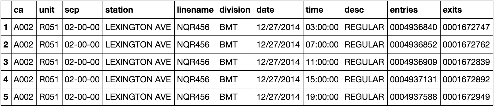
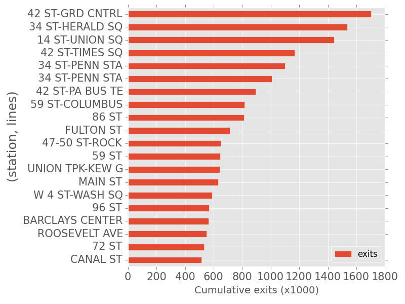
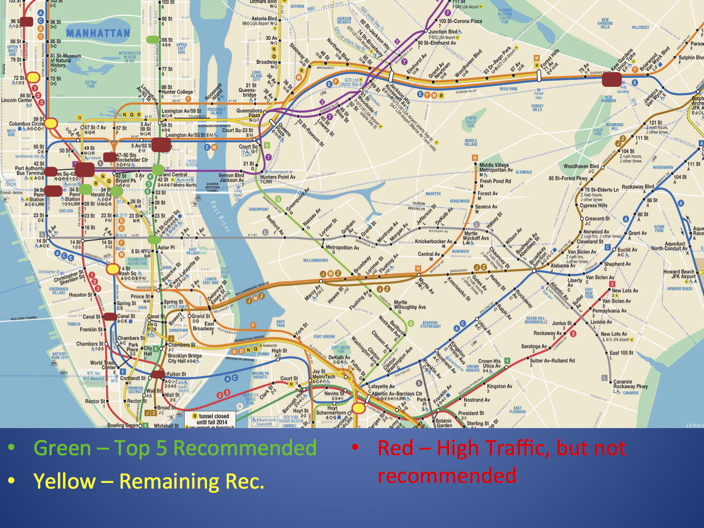
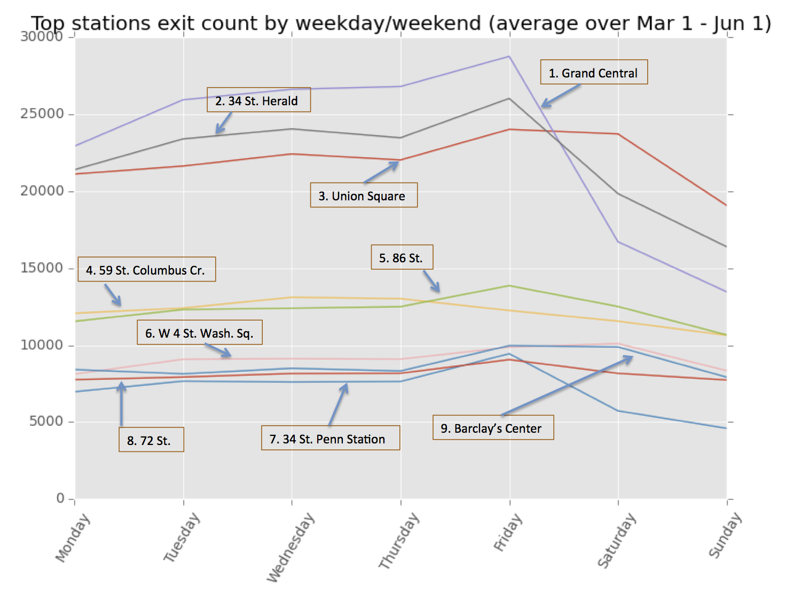

During the first week of class at Metis, the rest of the cohort and I had the pleasure of being overwhelmed by a rapidly approaching deadline. Our first project was for a (fictional) organization called WomenTechWomenYes, whose goal is to increase the participation of women in technology and to build awareness and reach for the company. WTWY was looking for help placing members of their street team at subway entrances in New York City, whose purpose is to find individuals interested in attending a gala in the early summer. We teamed up in groups of four to tackle this first project.

In any open-ended problem setting such as this, it's important to be careful in quantifying and naming your ...

## Assumptions
We found turnstile data that is made [publicly available](http://web.mta.info/developers/turnstile.html) by the Metropolitan Transportation Authority (MTA) of New York City. They recorded every turnstile entrance and exit at all 469 subway stations over the past five years, and published this data in a mercifully easy-to-read .csv format. With such a staggering amount of raw information at our fingertips, we knew we had to find the proper subset of this data to work with.

One big decision that we made was to look at subway exits instead of subway entrances. We reasoned that people who are on their way to catch a train are less likely to stop and talk to a stranger, especially when most strangers in New York are trying to [get your money](http://i.imgur.com/pQ7mhES.jpg).

Another choice we made is to focus solely on afternoons and evenings. We ruled out mornings and nights for much the same reason as outlined in the previous paragraph; our target time period was 12 noon to 7pm. We ruled out weekends because we hypothesized that less people use the trains on Saturday and Sunday; this might seem like a big assumption, but during our exploratory phase we were able to verify this claim.

Finally, since our client's gala is scheduled for the early summer, we decided to examine this year's springtime subway traffic. Our range of dates spanned from March 1, 2015 to June 1, 2015.

## Exploratory Data Analysis
We used the [pandas](http://pandas.pydata.org/) module for Python to read in and tabulate our data. The power of the pandas DataFrame is that it allows the user to slice and dice large tables quite naturally, as well as detect areas in the data that might be [missing](https://upload.wikimedia.org/wikipedia/en/thumb/a/a1/Oregon_election_results-DATA_MISSING.svg/455px-Oregon_election_results-DATA_MISSING.svg.png) or [corrupted](https://upload.wikimedia.org/wikipedia/commons/thumb/6/63/Data_loss_of_image_file.JPG/220px-Data_loss_of_image_file.JPG). The MTA collects eleven different statistics from every turnstile every few hours, and reports them in the format shown below.

One of the major challenges in interpreting this data was to figure out how to accumulate all of the turnstiles at a specific station. This task was made no easier by the fact that many station names (i.e. 86 ST, CANAL ST) are shared between distinct stations. We paired together Station Name and Line Name to determine unique stations, and summed together the readings from each turnstile at that station to get a station total for a given time interval.

As a first order estimate on which stations to place street team members at, we looked at which stations had the largest cumulative number of turnstile exits during our target times (i.e. Monday through Friday, noon to 7pm, March 1 - June 1).

There are no big surprises here; anyone who's ever visited New York is probably familiar with most of the top ten stations pictured here. But this very fact is what made us want to dig deeper: if these stations have numbers that are inflated by tourists and commuters, we may end up targeting the wrong population by placing street team members there.

## Heuristics

There were two other layers that we applied to the list above before coming up with our final suggestions to WTWY.

Firstly, we settled on a 30% penalty for any station known for being a commuter hub (i.e. Grand Central, Penn Station, Port Authority, etc.). We did this because other transportation fleets bring in tourists, commuters, and other individuals who we don't see as the client's base of supporters. It's important to note that this penalty did not take any of these terminals off the list; rather, it allowed other less obvious choices to bubble up towards the top. 

Another resource we integrated into our recommendations was [this](http://projects.newyorker.com/story/subway/) fun and informative graphic (courtesy of the New Yorker). The map reports the average income of the census tract closest to each subway station. Since we want to attract people who would be in a position to donate to WTWY's cause, we wanted to weight wealthier neighboorhoods more heavily. We set up a normalization equation that proportionately penalized stations below a certain threshold. While the people walking out of the subways certainly don't perfectly correspond to the people living in the neighborhood, we agreed that this was a good rule of thumb to implement.

## Results

After running our original list of most popular stations through our two heuristic filters, we arrived at the following list of final recommendations:

### First Tier
- Grand Central Terminal
- 34th St. - Herald Square
- Union Square
- 34th St. - Penn Station (123 line)
- 86th St. (456 line)

### Second Tier
- W. 4th St - Washington Square
- 72nd St.
- 59th St. - Columbus Circle
- Atlantic Avenue - Barclays Center

We advise WTWY to place the bulk of their street team members at the first tier stations listed above between the hours of noon and 7pm every day of the week. Depending on the size of the team, WTWY may also want to deploy members to our second tier stations. The draw for these stations is that they are slightly more removed from the hustle and bustle of Midtown (see the map above), and experience proportionately smaller dips in ridership over the weekends (see the average ridership chart below); if street team members were free to work on Saturday and Sunday, these would certainly be good targets to hit.

## Conclusion and Next Steps
Our first iteration of this project ended at a good place: we have some results that we are fairly confident in, and our code is written generally enough that we can quite easily revisit any of our assumptions that WTWY might want to modify. Given a few more weeks on this project, we might have looked into creating schedules for specific team members, or overlaying maps containing information about tech companies, especially those owned by or employing a large percentage of women. However bittersweet, it's time to leave behind Project Benson and forge ahead to our next project!

I hope you enjoyed my first (real) blog post. Come back for more in the coming weeks!